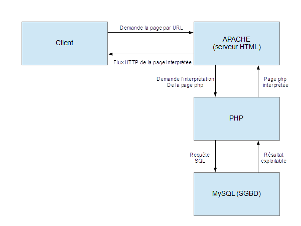
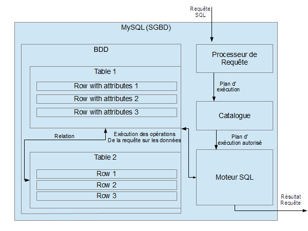

Glossaire SQL
=============

----------

| Notions SQL (ou BDD en général) | Définition |
|--------------|--------------------------------|
|**Banque de données** |  Collection de bases de données|
|**Base de données** | Collection de tables de données |
|**Table**| Collection de lignes d'enregistrement|
|**Ligne d'enregistrement**|Collection de données associées (exemple dans une table "client", une ligne peut contenir nom, prénom et adresse du client, dans des "cases" correspondantes)|
|**SGBD**|Système de Gestion de Base de Données|
|**Moteur SQL**|Programme qui manipule les fichiers de la BDD, et retranscrit les informations stockées de manière "lisible" |
|**Catalogue**|Description de la BDD ++ informations "subsidiaires" (typiquement les droits d'accès à la base de données)|
|**Requête**|Demande envoyée à la BDD, qui va renvoyer|
|**Langage de requête**|Langage informatique dans lequel sera codé les requêtes envoyés au SGBD|
|**Processeur de requête**|Programme d'interprétation de la requête|
|**Plan d'éxécution**|Liste des opérations à réaliser sur la BDD. pour une requête écrite dans le langage de requête, le processeur de requête détermine un plan d'éxécution. Après avoir vérifier que toutes les opérations nécessaires au plan d'éxécution sont autorisées à l'utilisateur (vérification dans le catalogue), le plan est envoyé au moteur SQL, qui renvoie le résultat de la requête|
|**Primary Key**|Clé primaire : ensemble de données d'un enregistrement (un ou plusieurs champs) permettant d'identifier de manière unique un enregistrement donné. La clé primaire est définie à la création de la table|
|**Foreign Key**|Clé étrangère : clé fasat référence dans une table à la clé primaire d'une autre table. Ce sont ces références entre tables qui permettent de créer des relations entre ces tables.|
|**Cardinalité**|La cardinalité définit, dans une relation entre 2 tables, le nombre d'élément de la table 1 que l'on doit référencer dans un enregistrement de la table 2. Il y a 4 types de cardinalité possibles : * 0..1 : Il y a 0 ou 1 enregistrement de la table 2 pouvant faire référence à un enregistrement de la table 1   * 1 : Un seul enregistrement de la table 2 peut et doit faire référence à un enregistrement de la table 1.   * 0..N : Il peut y avoir 0, 1 ou plusieurs enregistrements dans la table 2 faisant référence à un seul enregistrement dans la table 1.   * 1..N : Il y a au moins un enregistrement dans la table 2 faisant référence à un enregistrement dans la table 1, il est possible d'en avoir plusieurs.|
|--|--|
|**Langage de définition de données (LDD/DDL)**|Langage dans lequel s'écrit l'architecture de la BDD|
|**CREATE**|mot-clé pour créer un élément (**DATABASE**,**TABLE**,**VIEW**, **INDEX**)|
|**ALTER**|mot-clé pour modifier (altérer) un élément|
|**DROP**|mot-clé pour supprimer un élément|
|**Collation**|Table de conversion des caractères spéciaux, par exemple pour les tris|
|**COLLATE**|mot-clé définissant la collation à utiliser pour la table. ex. **COLLATE utf8_general_ci;**|
|--------------------|-------------------|
|**Langage de manipulation de données (LMD/DML)**|Langage dans lequel les requêtes INSERT SELECT UPDATE et DELETE sont écrites|
|--|--|
|**INSERT**|Insertion (création) de données dans une table|
|**SELECT**|Sélection (lecture) de données dans une table|
|**UPDATE**|Mise à jour (réécriture) de données dans une table|
|**DELETE**|Suppression de données dans une table|
|-------------------|--------------------------|
|**Langage de contrôle de données (LCD)**|Vérification des droits|
|---------------|---------------------------|
|**Langage de contrôle des transactions(LCT/TCL)**||
|----------------------------|---------------------|

/!\ Les colonnes en SQL sont typées et dépendent du SGBD/!\

| Notions SQL | Définition |
|---------------|---------------------|
|**TINYINT**|Entier encodé sur 1 octet (0-255 non signé ou -128-127 signé)|
|**SMALLINT**|Entier encodé sur 2 octet (0-2^16 non signé ou -2^15-2^15-1 signé)|
|**MEDIUMINT**|Entier encodé sur 3 octet (0-2^24 non signé ou 2^23-2^23-1 signé)|
|**INT**|Entier encodé sur 4 octet (0-2^32 non signé ou -2^31-2^31-1 signé)|
|**BIGINT**|Entier encodé sur 8 octet (0-2^64 non signé ou -2^63-2^63-1 signé)|
|**DECIMAL**/**NUMERIC**(p,s)|définition d'une variable réelle de précision (nombre de chiffres) p et de scale (nombre de chiffres après la virgule) s. max p = 65, max s = 30|
|**FLOAT**|Nombre à virgule flottante, de scale 23|
|**DOUBLE**| |

 